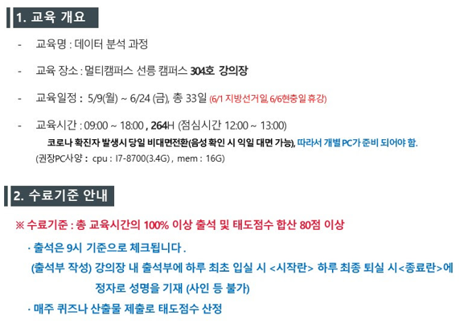

# Data Science Course for JBFG, 2022

Python For BigData @ <a href='https://www.facebook.com/jskim.kr'>FB / jskim.kr</a>, [김진수](bigpycraft@gmail.com)

 

## JB Financial Group

## Notice 
- [교육자료] : https://github.com/bigpycraft/ds22-jbfg-mc
- [공유폴더] : \192.15.206.251\ds\jbfg

## Table of Contents
- [Python Programming Basics][Sect-A]
- [Jupyter Notebook Practice][Sect-B]
- [Python Packages and Modules][Sect-C]
- [Data Processing and Analysis][Sect-D]

[Sect-A]: ./Sect-A/                  "Go Sect-A"
[Sect-B]: ./Sect-B/                  "Go Sect-B"
[Sect-C]: ./Sect-C/                  "Go Sect-C"
[Sect-D]: ./Sect-D/                  "Go Sect-D"

## Python Develop Environment

<h3> Python </h3>

<table align="left">
    <tr align="left">
        <td width="200">
            
        </td>
        <td width="800">

<b> Latest: Python 3.10.4 - March 24, 2022</b>
  
- Download : https://www.python.org/downloads/windows/
 
- Download the latest version 
 
- Check the OS version & bit (32bit / 64bit)

</td>
    </tr>
</table>
 

<h3> PyCharm </h3>

<table align="left">
    <tr align="left">
        <td width="200">
            
        </td>
        <td width="800">

<b> Latest : Python 3.10 version</b>
  
- Download : https://www.jetbrains.com/pycharm/download/
 
- Version: 2022.1.1
 
- Build: 221.5080.212
 
- Release Date: 13 April, 2022
 
- Download Community Version 

</td>
    </tr>
</table>
 

<h3> Jupyter Notebook </h3>

<table align="left">
    <tr align="left">
        <td width="200">
            
        </td>
        <td width="800">

<b> Latest : Version 2021.11 | Release Date: November 17, 2021 </b>
 
- Python 3.9 version
 
- Filename : Anaconda3-2021.11-Windows-x86_64.exe
 
- Download : https://www.anaconda.com/distribution/
 
- Check the OS version & bit (32bit / 64bit)

 

<b> Recommand Previous: Version 5.2 | Release Date: May 30, 2018 </b>
 
- Filename : Anaconda3-5.2.0-Windows-x86_64.exe
 
- Download : https://repo.continuum.io/archive/ 
 
- Reason : TF Requires Python 3.4, 3.5, or 3.6 
 
- TensorFlow : https://www.tensorflow.org/install/pip

</td>
    </tr>
</table>
 

<marquee>The BigpyCraft find the information to design valuable society with Technology & Craft.</marquee>

 &lt; The End &gt; 

